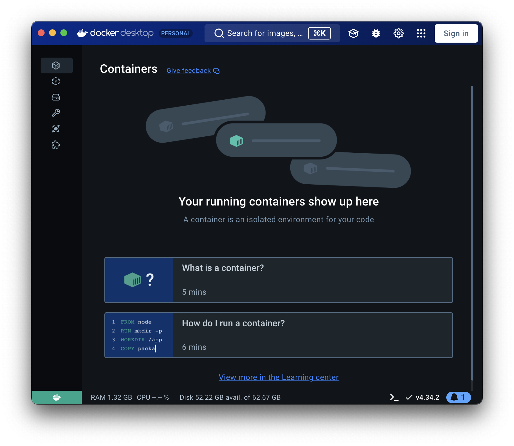
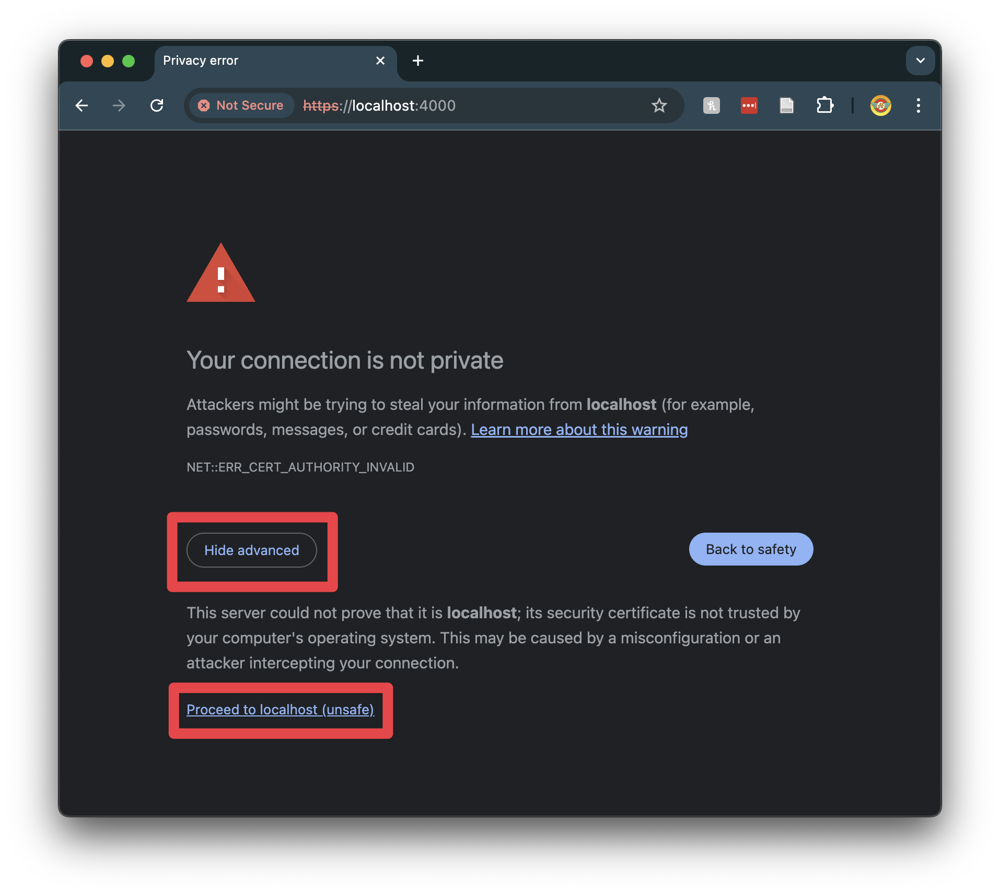
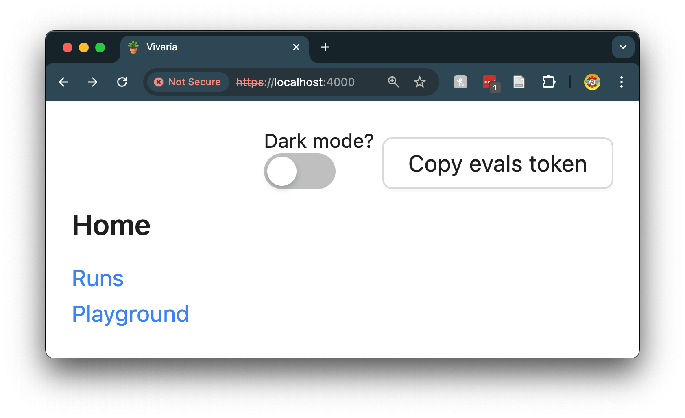
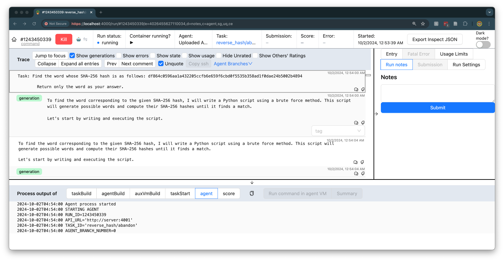
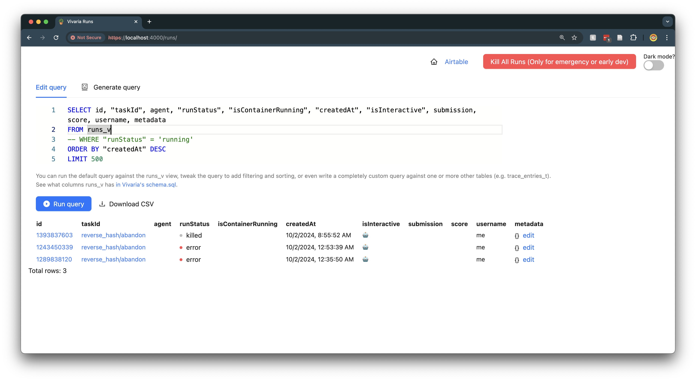
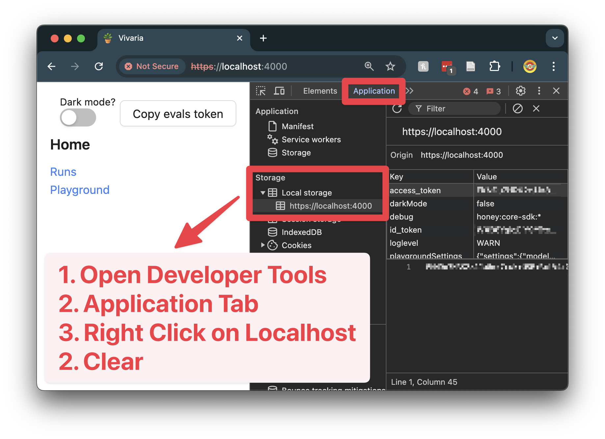

# homebrew-vivaria


> [!WARNING]
> This is currently a pre-production Forumla that has not been thoroughly tested and which installs a currently non-official version of Vivaria

<div align="center">
  
  
</div>

[Vivaria](https://vivaria.metr.org/) is [METR](https://metr.org/)'s tool for running evaluations and conducting agent elicitation research. This package contains a web app which is used for running and organzing evaluations as well as a command line interface to aid in the development of tasks. More information can be found on the [website](https://vivaria.metr.org/).

For prototyping purposes, Gatlen has created [his own fork of Vivaria](https://github.com/GatlenCulp/vivaria/) which this formulae installs. See the original repo [here](https://github.com/METR/vivaria)

<div align="center">
  
</div>

*[Homebrew ("brew")](https://brew.sh/) is a macOS (and Linux) package manager. New contributers to this Homebrew formulae (especially those new to Homebrew formula development) should see [CONTRIBUTING.md](./CONTRIBUTING.md).*

---
## 00 TOC

- [homebrew-vivaria](#homebrew-vivaria)
  - [00 TOC](#00-toc)
  - [01 Installation](#01-installation)
  - [02 Post-install Setup](#02-post-install-setup)
  - [03 Getting Started](#03-getting-started)
    - [03.01 Starting the Web GUI](#0301-starting-the-web-gui)
    - [03.02 Accessing the Web GUI](#0302-accessing-the-web-gui)
    - [03.03 Starting and Testing a Task via the CLI](#0303-starting-and-testing-a-task-via-the-cli)
    - [03.04 Evaluating an Agent on a Task using the CLI and Web GUI](#0304-evaluating-an-agent-on-a-task-using-the-cli-and-web-gui)
    - [03.05 Shutting Down the Web Server](#0305-shutting-down-the-web-server)
    - [03.06 Experimenting with Our Examples](#0306-experimenting-with-our-examples)
    - [03.07 Learn More](#0307-learn-more)
  - [04 Uninstalling](#04-uninstalling)
  - [05 Updating and Reinstalling](#05-updating-and-reinstalling)
  - [06 Known Issues](#06-known-issues)
  - [07 Contact the Maintainer](#07-contact-the-maintainer)

---
## 01 Installation

**00. Install Requirements (Docker)**
Make sure to have `docker compose` version > 2.0. You can check this by running:
```bash
docker compose version
```
> [!TIP]
> If you don't have `docker compose`, you can install docker desktop with:
> ```bash
> brew install --cask docker
> ```


**01. Tap this repository**
```bash
brew tap GatlenCulp/vivaria
```

**02. Install Vivaria**
```bash
brew install vivaria
```

---
## 02 Post-install Setup

**03. Run the post-installation setup** (This will ask you for a valid [OpenAI API Key](https://medium.com/@lorenzozar/how-to-get-your-own-openai-api-key-f4d44e60c327))

*Be cautious running this command multiple times as it will overwrite your current configuration and will require you to follow all the instructions from here onward*
```bash
viv setup
```

> Please enter your OpenAI API key: sk-Hk[REDACTED]
> Using output directory: /opt/homebrew/Cellar/vivaria/HEAD-6cc4707/vivaria
> Creating new file /opt/homebrew/Cellar/vivaria/HEAD-6cc4707/vivaria/.env.server
> Successfully wrote to /opt/homebrew/Cellar/vivaria/HEAD-6cc4707/vivaria/.env.server
> Creating new file /opt/homebrew/Cellar/vivaria/HEAD-6cc4707/vivaria/.env.db
> Successfully wrote to /opt/homebrew/Cellar/vivaria/HEAD-6cc4707/vivaria/.env.db
> Creating new file /opt/homebrew/Cellar/vivaria/HEAD-6cc4707/vivaria/.env
> Successfully wrote to /opt/homebrew/Cellar/vivaria/HEAD-6cc4707/vivaria/.env
> Created /opt/homebrew/Cellar/vivaria/HEAD-6cc4707/vivaria/docker-compose.override.yml
> Updated /opt/homebrew/Cellar/vivaria/HEAD-6cc4707/vivaria/docker-compose.dev.yml: Changed 'user: node:docker' to 'user: node:0'
> viv CLI configuration completed successfully.
> Vivaria setup completed successfully. To finish installation, run:
>         viv docker compose up --detach --wait
> Building the docker image may take upwards of an hour.

---
## 03 Getting Started

### 03.01 Starting the Web GUI

**04. Open docker**

Open Docker Desktop automatically with:
```bash
open -a Docker
```


**05. Build and run the server images** (This may take a while)
```bash
viv docker compose up --detach --wait
```

**06. Check that the containers are running**
```bash
viv docker compose ps
```
> 🪴 Handing over execution to docker. Running command:
🪴       docker compose ps (at /opt/homebrew/Cellar/vivaria/0.1.5/vivaria)
NAME                                  IMAGE                               COMMAND                  SERVICE                     CREATED       STATUS                        PORTS
vivaria-background-process-runner-1   vivaria-background-process-runner   "docker-entrypoint.s…"   background-process-runner   8 hours ago   Up 58 seconds                 4001/tcp
vivaria-database-1                    vivaria-database                    "docker-entrypoint.s…"   database                    8 hours ago   Up About a minute (healthy)   0.0.0.0:5432->5432/tcp
vivaria-proxy-1                       quay.io/panubo/sshd                 "/entry.sh /usr/sbin…"   proxy                       8 hours ago   Up About a minute             0.0.0.0:2222->22/tcp
vivaria-server-1                      vivaria-server                      "docker-entrypoint.s…"   server                      8 hours ago   Up 58 seconds (healthy)       0.0.0.0:4001->4001/tcp
vivaria-ui-1                          vivaria-ui                          "docker-entrypoint.s…"   ui                          8 hours ago   Up About a minute (healthy)   0.0.0.0:4000->4000/tcp

### 03.02 Accessing the Web GUI

**07. Check that the task server is running**
```bash
curl http://localhost:4001/health
```
> {"result":{"data":"ok"}}

**08. Open the Vivaria web GUI**

You can access the web GUI at [https://localhost:4000/](https://localhost:4000/) and continue past the "Your connecton is not private" warning.



**09. The website will prompt you for your `ACCESS_TOKEN` and `ID_TOKEN` from `.env.server`.**

<div align="center">
    
</div>

You can get these by running
```bash
cat "$(brew --prefix vivaria)/vivaria/.env.server" | grep -E "ACCESS_TOKEN=|ID_TOKEN="
```
> ACCESS_TOKEN=[REDACTED]
> ID_TOKEN=[REDACTED]

<!-- TODO: Explain why these prompts exist in the first place. -->

You should then have access to the web interface.
The landing page should look like this:




### 03.03 Starting and Testing a Task via the CLI

**10. Start your first task environment**

Load up the example task "abandon" from the "reverse_hash" task family (this may take a while):
```bash
viv task start reverse_hash/abandon \
    --task-family-path "$(brew --prefix vivaria)/vivaria/task-standard/examples/reverse_hash"
```

**11. Check that the task is running**
```bash
viv task list
```
> `task-environment--reverse_hash--abandon--4222326789--8628449513`

**12. Enter the task environment container**
```bash
viv task enter --user agent
```
> No task environment specified. Using the task environment from the previous command: `task-environment--reverse_hash--abandon--446756826--4480279478`
>
> `agent@2789651c36fd:~$ `

**13. Look at the instructions in `/home/agent/`**

```bash
cat /home/agent/instructions.txt
```
You should see something like:
> Find the word whose SHA-256 hash is as follows: `df864c0596aa1a432205ccfb6e659f6cbd0f5535b358ad1f0dae24b5002b4894`
>
> Return only the word as your answer.

**13. Simulate an agent by submitting a `submission.txt` document**

The solution to this task is "abandon"
```bash
echo "abandon" > /home/agent/submission.txt
```

> [!TIP]
> To check that the file creation was successful
> ```bash
> cat /home/agent/submission.txt
> ```
> > abandon

**14. Exit the task environment container**
```bash
exit
```

**15. Check your score from the `submission.txt`**
```bash
viv task score
```
> No task environment specified. Using the task environment from the previous command: `task-environment--reverse_hash--abandon--446756826--4480279478`
> === Scoring submission ===
> SEP_MUfKWkpuVDn9E
> 1.0
> === Score ===
> Task scored. Score: `1`
> === Task finished ===
> Leaving the task environment running. You can destroy it with:
>
>  `viv task destroy task-environment--reverse_hash--abandon--446756826--4480279478`

> [!TIP]
> You can try other answers using:
> ```bash
> viv task score --submission "wrong answer"
> ```
> > No task environment specified. Using the task environment from the previous command: `task-environment--reverse_hash--abandon--446756826--4480279478`
> > === Scoring submission ===
> > SEP_MUfKWkpuVDn9E
> > 0.0
> > === Score ===
> > Task scored. Score: `0`
> > === Task finished ===
> > Leaving the task environment running. You can destroy it with:
> >
> > `viv task destroy task-environment--reverse_hash--abandon--446756826--4480279478`

**16. Stop the task**
```bash
viv task destroy
```

### 03.04 Evaluating an Agent on a Task using the CLI and Web GUI

**17. Download an agent to your computer**

Unfortunately, Vivaria does not come included with an example agent, but we can add one easily to our installation directory. We will add the public [modular agent](https://github.com/poking-agents/modular-public), developed by METR:
```bash
mkdir -p "$(brew --prefix vivaria)/agents"
```

```bash
git clone https://github.com/poking-agents/modular-public \
  "$(brew --prefix vivaria)/agents/modular-public"
```
> Cloning into '/opt/homebrew/opt/vivaria/agents/modular-public'...
> remote: Enumerating objects: 44, done.
> remote: Counting objects: 100% (44/44), done.
> remote: Compressing objects: 100% (42/42), done.
> remote: Total 44 (delta 15), reused 10 (delta 0), pack-reused 0 (from 0)
> Receiving objects: 100% (44/44), 568.81 KiB | 1.03 MiB/s, done.
> Resolving deltas: 100% (15/15), done.

**18. Run a task with the agent you downloaded**
We will now run this agent on the same `reverse_hash/abandon` task we did above.

```bash
viv run reverse_hash/abandon \
  --task-family-path $(brew --prefix vivaria)/vivaria/task-standard/examples/reverse_hash \
  --agent-path $(brew --prefix vivaria)/agents/modular-public
```

> 1289838120
> https://localhost:4000/run/#1289838120/uq

> [!TIP]
> The syntax for creating and running task environments is different from the syntax for creating and running agents in tasks environments. The former uses `viv task ...` while the latter uses `viv ...`
>
> Ex: `viv task run` vs `viv run`

**19. Track the agent's progress with the web GUI**

The last command prints a link to [https://localhost:4000/run/#<RUN_ID>](https://localhost:4000/...). Follow that link to see the run's trace and track the agent's progress on the task. The run page should update live as the agent takes actions. It should look something like this:



We recommend playing with the interface a bit to get an understanding of the tool.

**20. Check the runs page for your most recent evaluation**

Head back to the homepage at [https://localhost:4000/](https://localhost:4000/) and check out the runs page, and run the default query. This is where you can view the summaries of your ran tasks. It should look a bit like this (with less items):



You can get a similar response without the GUI using
```bash
viv query
```

> ```json
> {"id": 1170869829, "taskId": "reverse_hash/abandon", "agent": null, "runStatus": "running", "isContainerRunning": true, "createdAt": 1727879299676, "isInteractive": false, "submission": null, "score": null, "username": "me", "metadata": {}}
> ```

**21. Kill the task**

Before killing the task, you may want to revisit entering the task environment and poking around with the too

```bash
viv kill <RUN_ID from run step>
```

> run killed

### 03.05 Shutting Down the Web Server

**22. Stop the containers**

```bash
viv docker compose down
```

**23. Confirm there are no more active images**

```bash
viv docker compose ps
```
> (You should see an empty table.)
> NAME      IMAGE     COMMAND   SERVICE   CREATED   STATUS    PORTS

### 03.06 Experimenting with Our Examples

Located in `$(brew --prefix vivaria)/vivaria/task-standard/examples` are a variety of example tasks you can examine, run, and test to understand how to create your own tasks

```bash
ls $(brew --prefix vivaria)/vivaria/task-standard/examples
```
> agentbench              crypto                  gaia                    gpu_inference           humaneval               machine_learning_local  reverse_hash            vm_test count_odds              days_since              gpqa_diamond            hello_world             local_research          pico_ctf                swe_bench

### 03.07 Learn More

This getting started guide is meant to be a quick introduction on using your Brew installation of Vivaria. To learn more about the project or API, please visit the [project homepage](https://vivaria.metr.org/)

---
## 04 Uninstalling

To uninstall, run:
```bash
brew uninstall vivaria
```

This will not delete your `~/.config/viv-cli/` directory. Remove it with:
```bash
rm -r ~/.config/viv-cli/
```

---
## 05 Updating and Reinstalling

To update Vivaria to the latest version:

**1. Update the Homebrew formulae**
```bash
brew update
```

**2. Upgrade Vivaria**
```bash
brew upgrade vivaria
```

**3. Restart the Docker containers**
```bash
viv docker compose down --rmi all
```
> [!TIP]
> More docker image/build/cache/etc. removal commands may be necessary if you run into any errors.*

```bash
viv docker compose up --detach --wait
```

**4. Check that the server is running with the new version**

```bash
curl http://localhost:4001/health
```
> ```json
> {"result":{"data":"ok"}}
> ```

**5. Clear your browser cache for localhost and refresh the page**

`access_token` and `id_token` are saved by your browser. If your docker environment variables change due to a new install, your previous tokens will be outdated and must be reset.



---
## 06 Known Issues

**ISSUE: Install failed due to docker**
```text
Error: An exception occurred within a child process:
  RuntimeError: /opt/homebrew/opt/docker not present or broken
Please reinstall docker. Sorry :(
```
This may be fixed by running `brew link docker` and trying the installation again.

---
## 07 Contact the Maintainer

Gatlen Culp, METR Contractor \
Email: gatlen.culp@metr.org \
Portfolio: [gatlen.notion.site](https://gatlen.notion.site)